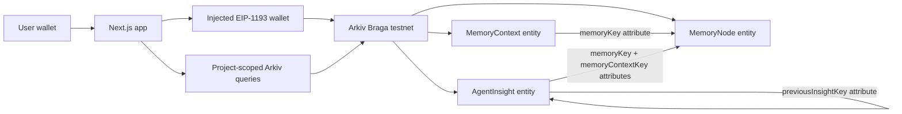

# SemanticAtlas

User-owned AI memory on Arkiv Braga testnet.

[Live demo](https://modifiervault.vercel.app) | [Demo video](https://www.loom.com/share/1f42e1f0253e46bba84221ad10064ab2) | [Arkiv docs](https://docs.arkiv.network/)

## Theme

**Theme: AI primary, Privacy secondary.** 

SemanticAtlas demonstrates portable, user-owned semantic memory for AI agents. A connected wallet writes memories, memory contexts, and agent insights to Arkiv; optional client-side encryption keeps sensitive payloads confidential while public attributes remain queryable.

The privacy model separates semantic structure from semantic payload. Ownership, provenance, lineage, domains, modifiers, and content modes can stay public and searchable; raw memory content can be omitted or encrypted locally before it is written to Braga.

## What It Does

SemanticAtlas stores a small AI memory graph on Arkiv:

- `MemoryNode`: the user-owned memory payload or encrypted payload envelope.
- `MemoryContext`: queryable instructions that describe how an agent should expand, route, transform, or remember the memory.
- `AgentInsight`: an AI-generated semantic interpretation artifact linked back to the memory and context.

Every entity and every query uses this unique project attribute:

```txt
project = "semantic_atlas_v1"
schemaVersion = "1"
```

## Architecture




Key Arkiv concepts used:

- Payloads are JSON and use `contentType: "application/json"`.
- Attributes power indexing and relationships.
- `schemaVersion`, `contentMode`, `domain`, `interpreter`, and modifier attributes power semantic graph queries.
- `expiresIn` is configurable through `NEXT_PUBLIC_ARKIV_EXPIRES_IN_SECONDS`.
- `$owner` is the wallet that can update/delete an entity.
- `$creator` is immutable attribution for who created the entity.

## Privacy Modes

| Mode | Arkiv payload | Queryable attributes |
| --- | --- | --- |
| Public memory | Plain JSON content | Project, schema, type, domain, visibility, contentMode |
| Metadata-only memory | Preview and metadata only | Same query fields, no raw memory content |
| Encrypted memory | AES-GCM encrypted envelope | Same query fields, ciphertext only |

Encrypted mode uses the browser Web Crypto API with PBKDF2 -> AES-GCM. The app does not store the passphrase. To generate an AI reflection from encrypted content, the user must decrypt locally and explicitly send the decrypted content to the reflection generator.

## Tech Stack

- Next.js App Router, React, TypeScript
- Arkiv SDK `@arkiv-network/sdk`
- Viem wallet transport for browser signing
- Web Crypto API for local payload encryption
- Groq Chat Completions for AgentReflection generation
- Vercel deployment
- MIT license

## Braga Network

The app targets Arkiv Braga:

```txt
Chain ID: 60138453102
RPC URL: https://braga.hoodi.arkiv.network/rpc
Explorer: https://explorer.braga.hoodi.arkiv.network
Entity explorer: https://data.arkiv.network
```

## Setup

Prerequisites:

- Node.js 20+
- npm
- A browser wallet with Braga testnet GLM for writes

Install and run locally:

```bash
npm install
cp .env.example .env.local
npm run dev
```

Open `http://localhost:3000`.

Environment variables:

```bash
NEXT_PUBLIC_ARKIV_RPC_URL=https://braga.hoodi.arkiv.network/rpc
NEXT_PUBLIC_ARKIV_EXPLORER_URL=https://explorer.braga.hoodi.arkiv.network
NEXT_PUBLIC_ARKIV_EXPIRES_IN_SECONDS=2592000
GROQ_API_KEY=gsk_YOUR_GROQ_API_KEY
GROQ_MODEL=llama-3.1-8b-instant

# Optional. Needed only for the Braga CLI smoke test.
ARKIV_PRIVATE_KEY=0xYOUR_BRAGA_TESTNET_PRIVATE_KEY
```

Never expose a private key or AI provider key as `NEXT_PUBLIC_*`.

## Demo

1. Open the [live demo](https://modifiervault.vercel.app).
2. Go to `/create`.
3. Connect a browser wallet and switch to Arkiv Braga when prompted.
4. Create the seeded `Private Thinking Pattern` as public, metadata-only, or encrypted memory.
5. Open the generated `/memory/[key]` route to inspect owner, creator, payload mode, attributes, and linked entities.
6. If encrypted, decrypt locally with the passphrase, then generate an AgentReflection through Groq.
7. Write the AgentReflection to Arkiv and inspect lineage/provenance.
8. Go to `/query` and search by modifier, domain, interpreter, owner, creator, memory key, visibility, or content mode.

Video walkthrough: https://www.loom.com/share/1f42e1f0253e46bba84221ad10064ab2

## Verification

Local checks:

```bash
npm run verify
npm audit --audit-level=moderate
```

Braga smoke test:

```bash
# Requires ARKIV_PRIVATE_KEY in .env.local
npm run test:braga
```

The local smoke test verifies encryption/decryption, metadata-only non-leakage, and reflection prompt shape. The Braga smoke test creates a schema v2 `MemoryNode`, linked `ModifierStack`, and linked `AgentReflection`, then verifies project/schema/domain/modifier/interpreter queries.

Recent verification evidence is tracked in [VERIFICATION.md](VERIFICATION.md).

## Submission Info

| Field | Value |
| --- | --- |
| Theme | AI + Privacy |
| GitHub repo | https://github.com/beaconsmith/arkiv-modifier-vault |
| Demo link | https://modifiervault.vercel.app |
| Demo video | https://www.loom.com/share/1f42e1f0253e46bba84221ad10064ab2 |
| Team | Nzube Ndiokwelu |
| GitHub handle | `beaconsmith` |


## License

MIT. See [LICENSE](LICENSE).
